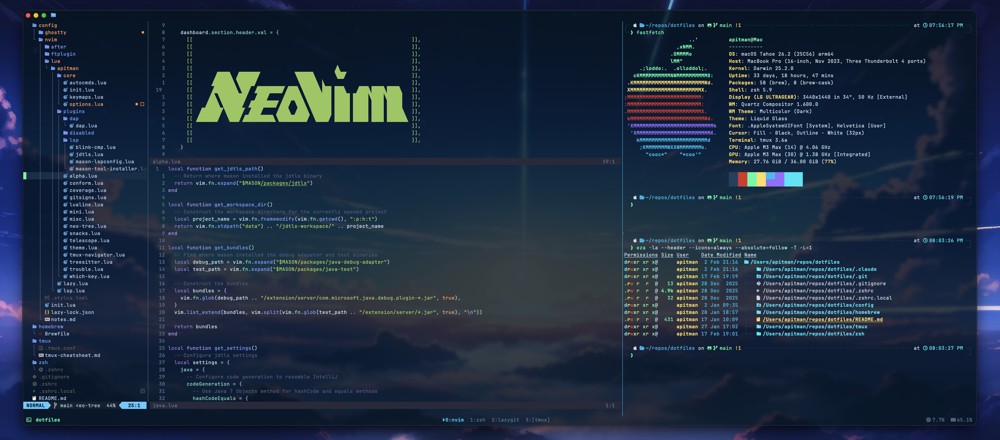

# Dotfiles



Neovim, Ghostty, tmux, zsh. Managed with [GNU Stow](https://www.gnu.org/software/stow/).

## Install

```sh
brew bundle --file=homebrew/Brewfile
```

## Setup

```sh
stow -t ~/.config config
stow -t ~ zsh
stow -t ~ tmux
```

## Unlink

```sh
stow -D -t ~/.config config
stow -D -t ~ zsh
stow -D -t ~ tmux
```
